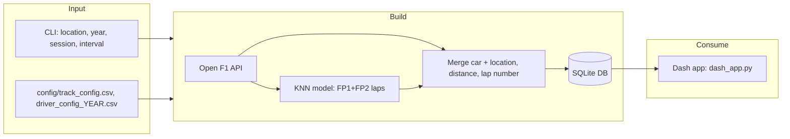

# F1 Live Telemetry

Build a session database of F1 telemetry and session data for a given circuit and session, then view it in a live or replay Dash dashboard.

**Quick start:** `pip install -r requirements.txt` → create `config/`, `data/`, `knn/`, `track_layout/` if needed → `python update_db.py Melbourne 2024 Race 60` → `python dash_app.py Melbourne 2024 Race` → open http://127.0.0.1:8050

---

## 1. What does this project achieve

- **Purpose:** Build a session database (SQLite) of F1 telemetry and session data for a given circuit and session (e.g. Race), suitable for **live** ingestion during a race or **replay** of past sessions.

- **Outcomes:**
  - A single SQLite DB per session (`data/{session_key}.db`) with tables: `weather`, `laptimes`, `position`, `race_control`, `interval`, `stints`, `telemetry`.
  - **Telemetry** = merged car data (rpm, speed, throttle, brake, gear, DRS) + GPS (x, y, z) + **distance along track** and **lap number**, enabling track-position and lap-based visualisations.
  - A **Dash app** (`dash_app.py`) that reads this DB and provides live/replay dashboards (positions, laptimes, track map, race control, etc.).

---

## 2. How it works (overview)

- **Data source:** [Open F1 API](https://api.openf1.org) (sessions, drivers, car_data, location, weather, laps, position, race_control, intervals, stints).

- **High-level flow:**



- **Two phases:**
  1. **One-time (or cached) per circuit/year:** Build a KNN model that maps (x, y) → distance along track using the fastest laps from the first two sessions of the weekend (FP1/FP2). Stored in `knn/knn_{location}-{year}_FP1_FP2_top25.pkl`; track layout in `track_layout/{location}-{year}.csv`.
  2. **Per session run:** Loop over time windows (from race start + 1 minute, step = `interval` seconds). In each window: fetch session data from the API, merge car + location per driver, compute distance (L2 + KNN blend) and lap numbers, run continuity checks, append/replace into the SQLite DB.

- **Scripts:**
  - **update_db.py** – live or replay: sliding time windows, writes to `data/{session_key}.db`.
  - **update_db_historical.py** – historical replay with fixed interval (no sliding window); same config and utils.
  - **dash_app.py** – reads DB and serves Dash UI (same CLI args: location, year, session).

---

## 3. Technicals

### 3.1 Requirements

- **Python:** 3.x compatible with the listed packages.
- **Dependencies** (see `requirements.txt`): `dash`, `dash_bootstrap_components`, `numpy`, `pandas`, `plotly`, `Requests`, `scikit_learn`, `scipy`, `SQLAlchemy`, `tqdm`.
- **External:** Open F1 API (network); no API key.
- **Config (mandatory):**
  - `config/track_config.csv`: columns include `circuit_location`, `circuit_length`, `total_laps`, `start_line`, `before_start_line`, `after_start_line`, `corners` (Python-evaluated tuples/lists). Circuit names must match API `location` (e.g. `Sakhir`, `Melbourne`).
  - `config/driver_config_{year}.csv`: e.g. `driver_number`, `name_acronym`, `team_name`, `team_colour`, `team_order`, `driver_order`, `team_acronym`.
- **Directories:** Scripts expect `config/`, `data/`, `knn/`, `track_layout/` (create if missing; `data/*.db` and `knn/*.pkl` are in `.gitignore`).

### 3.2 Implementation

#### 3.2.1 Logic behind the solution

- **Distance along track:** The API gives (x, y) only. Distance is inferred by:
  - **L2 (geometry):** Signed distance from start line using `compute_l2()` in `utils.py` and the three points from config (`start_line`, `before_start_line`, `after_start_line`). Used especially near start/finish.
  - **KNN regressor:** Trained on (x, y) → distance using the top 25 laps (by duration) from FP1+FP2; distance in training comes from speed integration (`compute_distance()` in `utils.py`).
  - **Blending:** `get_best_distance()` uses a threshold (4% of circuit length, `thresh = 0.04` in `update_db.py`). When the previous point is within that threshold of 0 or circuit_length, L2 is preferred (with wrap-around for negative L2); otherwise KNN is used. This avoids lap-boundary jumps.

- **Lap assignment:**
  - **Telemetry:** `assign_lap_number()` in `utils.py`: lap increments when backward change in `actual_distance` exceeds 90% of circuit length (lap crossover).
  - **Position table:** `assign_lap()` maps timestamp to lap using a lap_map built from official laptimes (`update_lap_maps()`).

- **Continuity cleaning:** In `update_db.py`: for `actual_distance < 0.97*circuit_length`, points are dropped if step is >500 m forward or <-300 m backward to remove GPS/merge spikes.

- **Time windowing (live):** Next window start = max of last car_data date and last location_data date, so the script follows the latest available data (live or replay).

#### 3.2.2 Approximations and assumptions

- **Sessions for KNN:** The first two sessions of the weekend are used (e.g. FP1 and FP2), not strictly by name.
- **Track geometry:** Start line and direction are approximated by three points in config; L2 distance is a linear projection.
- **Distance training:** KNN training uses speed-based distance integration over a lap; small timing/merge errors accumulate.
- **Thresholds:** 4% for start/finish band; 90% circuit length for lap crossover; 500 m / -300 m for continuity; 0.97× circuit_length for applying continuity check.
- **Race start:** Telemetry loop starts at `race_start_time + 1 minute` to avoid formation-lap noise.
- **Driver set:** All drivers in `driver_config_{year}.csv` are processed; no automatic detection of who is actually in the session.

### 3.3 Caveats

- **API availability and rate limits:** Depends on Open F1; no retries or backoff in current code.
- **Session/circuit mismatch:** If config location or session name doesn’t match API (e.g. "Australia" vs "Melbourne"), lookups fail. Use exact `circuit_location` and session names (e.g. "Race", "Qualifying") as in the API.
- **Replacing DB:** Each run of `update_db.py` removes the existing `data/{session_key}.db` before writing.
- **Laptimes vs telemetry lap offset:** Lap number in laptimes can be offset by 1 vs telemetry; this is a known issue.
- **No persistence of ingest state:** If the script stops, the next run starts from a fresh DB (no resume).
- **Dash and DB in sync:** Dash expects the DB to exist and to be written by the same location/year/session; running update_db with different args requires restarting Dash with matching args.

### 3.4 To be done

- **Dash:** Position vs lap plot; filter blue flags in race control; team radio table; organise layouts; live time-delta plots; fix live laptimes fetch; single query for telemetry plot; match laptime label to plot; improve table UI; memoise computations.
- **Core:** Lap number adjust logic; live time delta; fuel-corrected laptimes; configurable lap assignment (e.g. per-driver offset in UI); tyre compound data; separate tabs/views for quali vs race; save/resume state for update_db; pit duration/stationary time; historical tyre deg.

Full checklist and changelog: [TODO.md](TODO.md).

---

## 4. Usage

**Create/update session DB (live or replay):**

```bash
python update_db.py <location> <year> <session> <interval>
```

Example: `python update_db.py Melbourne 2024 Race 60`

- `location` = circuit_location in track_config (e.g. `Sakhir`, `Melbourne`, `Jeddah`)
- `session` = e.g. `Race` or `Qualifying`
- `interval` = time window in seconds

**Historical replay (alternative):**

```bash
python update_db_historical.py <location> <year> <session>
```

Uses a fixed 45 s interval; see script for any extra setup.

**Run Dash app (after DB exists):**

```bash
python dash_app.py <location> <year> <session>
```

Example: `python dash_app.py Melbourne 2024 Race`  
Then open the URL printed (e.g. http://127.0.0.1:8050).

**First run per circuit/year:** The script will build and save the KNN model and track layout (requires FP1/FP2 data in the API). Ensure `knn/` and `track_layout/` exist (or create them); `data/` for DB output.

---

## 5. Debugging and contributions

**Debugging:**

- **API:** Inspect responses from `utils.get_data()` / `get_data_channels()`; validate session keys and date ranges from `utils.get_session(location, year)`.
- **Distance/laps:** Check `distance_l2`, `distance_regr`, `actual_distance` and lap_number in a sample of merged_data; watch for continuity messages (e.g. "X points deleted in DRIVER's N Lap").
- **DB:** Inspect tables with SQLite or pandas: `pd.read_sql_query("SELECT * FROM telemetry LIMIT 10", engine)`.
- **Config:** Ensure `circuit_location` matches API location; ensure driver_config has the right year and columns.

**Contributions:**

Contributions are welcome. Suggested approach: run with a small `interval` and one circuit/year first; add tests for `utils` (e.g. `compute_l2`, `get_best_distance`, `assign_lap_number`) and document how to run them if tests exist. The codebase uses pandas + SQLAlchemy without type hints; new code can follow the same patterns.
